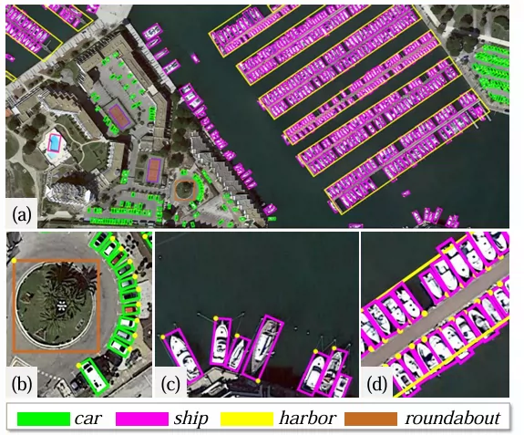
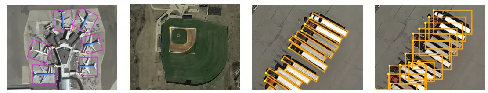
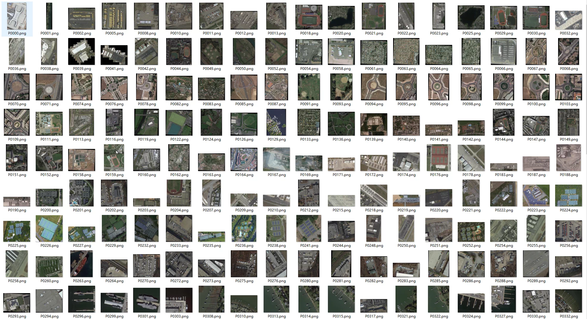
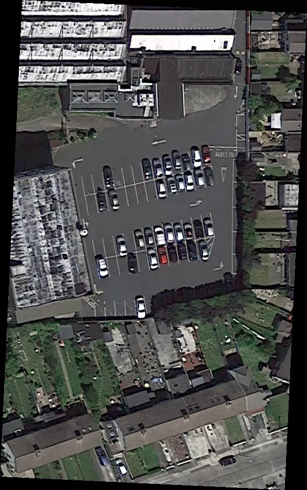
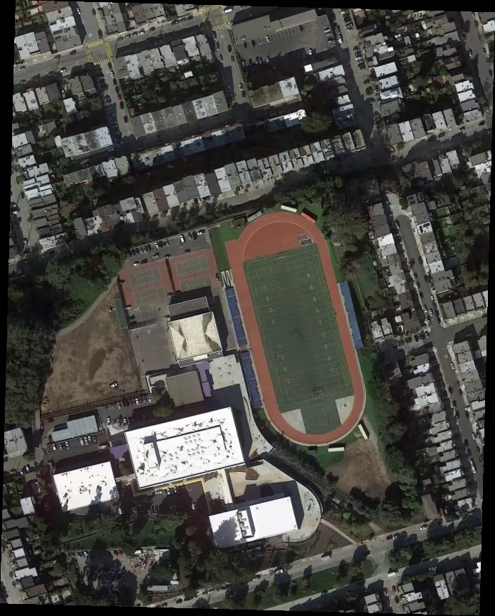

## Body

Aerial Imagery Object Detection Dataset in YOLO format

The dataset consists of three versions, totaling about 130G. It includes articles.

I. DOTA-v1.0 (15 classes, basic version)
plane (aircraft)
ship (ship)
storage-tank (oil tank)
baseball-diamond (baseball field)
tennis-court (tennis court)
basketball-court (basketball court)
ground-track-field (athletics track)
harbor (port)
bridge (bridge)
large-vehicle (bus, heavy truck)
small-vehicle (car, SUV)
helicopter (helicopter)
roundabout (roundabout)
soccer-ball-field (soccer field)
swimming-pool (swimming pool)

II. DOTA-v1.5 (16 classes, based on v1.0 with 1 new class)

Added: container-crane (container crane / port crane)

III. DOTA-v2.0 (18 classes, based on v1.5 with 2 new classes)

Added: airport (airport) helipad (helicopter pad)

## Images

item_1057150293675

Here is a pay link on Stripe ( https://buy.stripe.com/3cs8yP7sY87d0vu9AB ). Please contact me lonlonago@foxmail.com after funding $89, and I will send you a complete data files , thank you!

